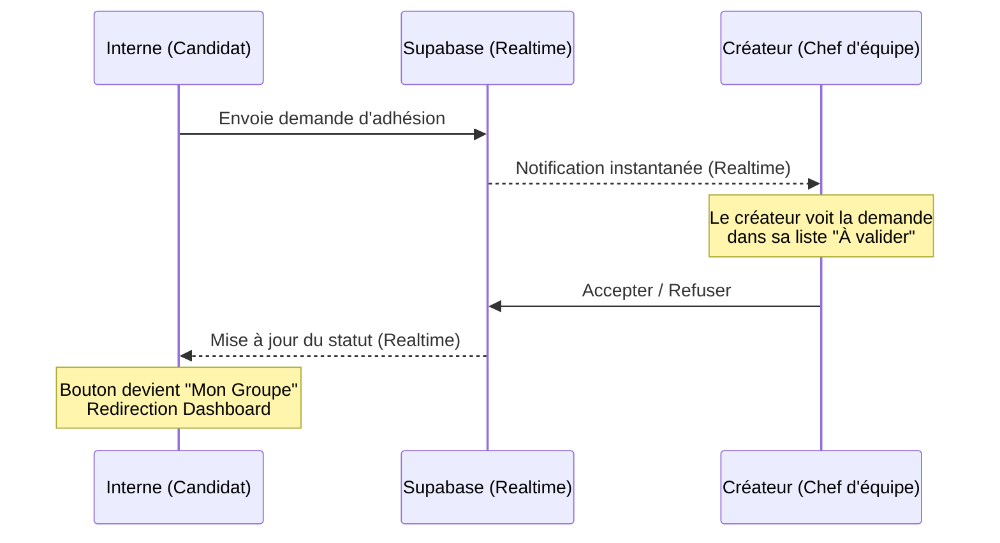
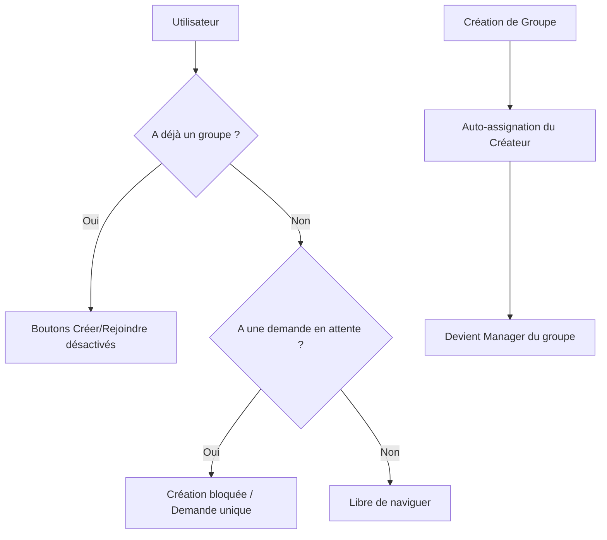

# ⚡ Shiftly

**Shiftly** est une application web moderne (PWA) conçue pour la planification équitable des gardes des internes et médecins hospitaliers. Elle permet de former des groupes, de gérer les demandes de rejoindre une équipe et de générer un planning juste basé sur un algorithme de distribution circulaire (round-robin).

## ✨ Fonctionnalités Clés

- **Système de Groupes** : Créez votre équipe ou rejoignez-en une existante via un code unique.
- **Validation Créateur** : Les créateurs de groupes valident les demandes d'adhésion en temps réel.
- **Planning Intelligent** : Distribution automatique et équitable des gardes sur une période donnée.
- **Temps Réel** : Mises à jour instantanées des statuts et du planning via Supabase Realtime.
- **Expérience Mobile (PWA)** : Installez Shiftly sur votre écran d'accueil iPhone ou Android pour une expérience fluide.

## 🛠️ Stack Technique

- **Frontend** : Vite, React 18, TypeScript, TailwindCSS.
- **Backend & Database** : Supabase (PostgreSQL, Realtime, RLS).
- **State Management** : Zustand & TanStack Query (React Query).
- **Icongraphie** : Lucide React.

## 📊 Fonctionnement du Système

### Flux d'Adhésion à un Groupe

### Architecture des Règles Métier (Beta Test)

## 🚀 Installation & Déploiement

### Local
1. Clonez le projet.
2. `npm install`
3. Copiez `.env.example` en `.env` et remplissez vos clés Supabase.
4. `npm run dev`

### Déploiement Vercel
Le projet est optimisé pour Vercel (voir `vercel.json`).
1. Connectez votre repo à Vercel.
2. Ajoutez les variables `VITE_SUPABASE_URL` et `VITE_SUPABASE_ANON_KEY`.
3. Le déploiement est automatique !

## 📱 Installation Mobile
Une fois déployé :
1. Ouvrez l'URL sur votre téléphone.
2. **iOS** : Partager > "Sur l'écran d'accueil".
3. **Android** : Menu > "Installer l'application".

---
*Développé avec ❤️ pour faciliter la vie des internes.*
